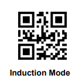

# Home Assistant (and Mealie) Barcode Scanner and Product Lookup
Being big users of both Home Assistant and Mealie, for a while I've looked for a solution to add items quickly to our Mealie shopping list by scanning the product barcode. I’ve seen lots of questions about the same idea on the HA community and Reddit, but haven’t seen any great solutions. So I set about making my own solution. The code for which and my notes as I develop the solution can be found in this repository.

> [!IMPORTANT]
> This project is a work in progress and is currently no more than a Proof Of Concept (PoC). Therefore it is subject to change and the code and examples in this repository may not work. The below is not an exhaustive walkthrough and so a reasonable understanding of Home Assistant and ESPHome will be needed to successfully follow and implement.

> [!WARNING]
> No warranties or guarantees are made regarding the contents of this repository. Anyone using the code or instructions does so at their own risk!

## The Idea
The main idea is to have a way to scan a product barcode whilst preparing a meal in the kitchen and have that item added to the weekly supermarket shopping list. To ensure it is used by the whole family, it needs to be fast and simple to scan a barcode whilst preparing a meal. Ideally it will use a device mounted in the kitchen so that it doesn't require a mobile phone to work. 

Once a barcode is scanned, it will need to be converted to a product name and then added to the shopping list. This could be any To-Do list in Home Assistant, including one created and synched by the Mealie integration. It will need to a method to highlight when a product name can't be found and to prompt the user to add the product name manually. This should be store for future lookup.

## The Solution
The planned solution is made up of 3 main parts: 
1. A hardware solution to scan the product barcode and pass it to Home Assistant. This is powered using ESPHome of speed of implementing and ease of integrations.
2. A Python script running in the Pyscripts integration in Home Assistant which looks up a barcode on the UPCDatabase.org and/or OpenFoodFacts.org API and returns the product name.
3. A Home Assistant Automation to link the above together, triggering when a barcode is scanned, passing it to the Python script to get the name and then adding it to the desired shopping list.

### The Hardware

For simplicity of creation and integration with Home Assistant, prototype hardware has been created using [ESPHome](https://esphome.io/). The final hardware solution will likely also use ESPHome. If it is ever productionised, ESPHome can also be used with ability to register a product for automatic updates, etc. 

#### Parts

The minimum required hardware would be:
- An ESP8266 or ESP32 development board which can be brought widely on ebay or Aliexpress for under £5 (GBP). (e.g. [https://www.ebay.co.uk/itm/166478265403](https://www.ebay.co.uk/itm/166478265403))
- A suitable barcode scanner such as GM67 which can be brought widely on ebay and Aliexpress for around £20 (GBP). (e.g. [https://www.ebay.co.uk/itm/365225165259](https://www.ebay.co.uk/itm/365225165259))


Optionally, you could also add a screen or LEDs to indicate if a scanned product was successfully identified. You could also add buttons to switch the scanner on and off or even to change which list you would like the product adding to. I might add these features to my eventual solution. 

#### Wiring
We need to wire the GM67 to the ESP board. Which pins on the ESP board you choose to use is up to you but your ESPhome YAML needs to match the pins. The below table shows the wiring colours and pins for the example ESPHome YAML files.

> [!CAUTION]
> The wiring colours of the cable provided with the GM67 are not standard. Care should be taken to ensure the correct wiring in order to not damage either the GM67 or the ESP board. Do not rely on the wiring colours as the cable provided may not be the same as the one I received.

| ESP Board Pin  | GM67 Board UART/TTL Pin | Supplied Wire Colour |
| -------------- | ----------------------- | -------------------- |
| GND            | GND                     | Green                |
| RX             | GPIO13                  | Yellow               |
| TX             | GPIO15                  | Black                |
| 5V             | 5V                      | Red                  |

The cable provided for UART/TTL with the GM67 had bare wires to which I added Dupont connectors to make it simple to connect to the ESP board. You can connect however you wish (e.g. soldering). 

#### GM67 Configuration
Out of the box, the GM67 I received was configured to only talk on the USB interface. Unless this is changed, it won't interface and send barcodes to the ESP board. To change settings on the GM67 there is an extensive document containing special QR codes to apply settings. The documentation for all of the GM range of barcode scanners can be found [HERE](https://www.dropbox.com/scl/fo/87hz5h82k25j3p9k5u603/AJfkL6iYDATRGkLYJjuhUJE?rlkey=2fyvdir15kb1kj2ada1zkadqt&e=1&dl=0).

Assuming you have the GM67 like I do, you can scan the following QR code with the scanner to enable UART/TTL mode:


I also chose to change some additional settings on the GM67. By default the scanning lights are always on which can become annoying with it constantly flashing. The mode can be changed to a "Induction" mode in which it instead turns off the lights until a product is detected in front of the scanner. It isn't perfect as it seems to work by detecting the light level changing but its better than the constant flashing. To set inductions mode you can scan the following QR code:



And finally, out of the box, the barcode scanner will scan a barcode every 500ms, including the same barcode. This can cause unintentional duplicate reads of the same barcode if you don't remove it from in front of the scanner quickly enough. Scanning the below QR code will set the scanner to only accept the same barcode after a 3 second delay which helps to mitigate this problem:


Having set the above, so far the GM67 has been very accurate and reliable. 

> [!TIP]
> The GM67 seems to be good at reading codes from screens also and so you can open this page on your phone to be able to scan the above codes easily. 

#### ESPHome YAML
An example ESPHome YAML configuration file can be found in this repository under [/esphome/example-esphome-gm67.yaml](esphome/example-esphome-gm67.yaml). Some of the sensors created in the example are disabled in HA by default but can be enabled to help with debugging. 

> [!TIP]
> If you have any issues creating the hardware, you can try adding the following to your ESPHome YAML configuration:
> ```
> logger:
>   level: VERBOSE
> ```
> This will enable more detailed debug logging which should include all UART messages coming from the barcode scanner.

I may add more to the above example over time or add additional examples.

#### Home Assistant Device Config
The new device should show up in HA called "barcode-scanner" unless you changed it in the ESPHome YAML. Add it to Home Assistant as you would any other ESPHome device (it should be automatically found by HA). 

> [!IMPORTANT]
> If you do not perform the next steps, the ESPHome device will not be able to trigger events on the Home Assistant event bus which are needed to trigger the Home Assistant Automation later.

Follow the below steps to allow the device to trigger events on the HA event bus:
1. Open the ESPHome integration page on your Home Assistant instance:
[](https://my.home-assistant.io/redirect/integration/?domain=esphome)
2. Find your barcode scanning device in the device list.
3. Click the “configure” button next to it.
4. Check the “Allow the device to perform Home Assistant actions” box.
5. Then click “submit”.

You can now check the device is working and connected to Home Assistant correctly:
1. Navigate to Developer Tools -> Events
2. Under "Listen to events" enter "esphome.barcode_scan"
3. Click "Start listening"
4. Scan a barcode with the device and you should see an event appear containing a line beginning "barcode:" followed by the barcode you scanned. Something like the below:
    ```
    event_type: esphome.barcode_scan
    data:
      device_id: ee685dc4d9ccb1de6e97a84beb7be650
      barcode: 4088600550862
    origin: LOCAL
    time_fired: "2025-01-20T12:54:21.634458+00:00"
    context:
      id: 01JJ1WEGP22MANX2VFREP5B2JV
      parent_id: null
      user_id: null
    ```

> [!IMPORTANT]
> Ensure you have the above working and can see the "barcode_scan" events in Home Assistant before moving on.

### Product Lookup
A custom python script is used to look up a passed product barcode on the [openfoodfacts.org](https://openfoodfacts.org/) website and return the name of the product. Home Assistant can run custom python scripts directly but additional python libraries can't be important which limits what can be done with them.

Instead, we can use the [Pyscript(https://github.com/custom-components/Pyscript)] integration which is available under HACS to run our python script instead.  

#### Install the Pyscript Integration in HA
If you aren't already using Pyscripts for some other purpose then you need to install it. Full instructions for how to install the Pyscript integration can be found on the repository [https://github.com/custom-components/Pyscript](https://github.com/custom-components/Pyscript). 

Assuming you have HACS installed within your HA instance, simply search for "Pyscript" within HACS or click on this button [](https://my.home-assistant.io/redirect/hacs_repository/?repository=pyscript&owner=custom-components), and then install it. 

Once installed, you need to add the integration under the integrations section of Home Assistant. [](https://my.home-assistant.io/redirect/config_flow_start/?domain=pyscript).

> [!IMPORTANT]
> Make sure to check the option for "Allow All Imports?" when installing Pyscript. If you do not, our python script will not be able to load the needed python modules. Don't worry if you missed it or already have Pyscripts installed, you can set this option by going to the Pyscript integration page and clicking on "CONFIGURE".

#### Add the python script under Pyscripts
[Coming Soon]
<!-- Add the python script under the Pyscripts folder and check the service can be called. Folders need to be created. Also need to update/create the Pyscripts config.yaml file. -->

### Home Assistant Automation
[Coming Soon]
<!-- Need to change current automation to use the HA event esphome.scanned_barcode and upload an example yaml -->

## Planned Improvements / To Investigate
- [ ] Implement lookup on openfoodfacts.org (seems to be the most populated and clean), then if no match found try upcdatabase.org instead. Possible other sources of product lookup.
- [ ] Implement a local cache of barcodes and their product names to prevent hitting the APIs unnecessarily and also to allow adding custom matches to override or for unknown products.
- [ ] Consider implementing the automation and python as a HA integrations for easier set up. Might be less flexible though.
- [ ] A screen for feedback of if the scanned code was found and buttons to change which shopping list you want the product added to.
- [ ] Investigate if a scanned product can be found on Amazon and added to your shopping basket ready for purchase.
- [ ] Investigate sending serial commands to the GM67 to allow for options in the HA device to configure the scanning mode, to turn off the scanner, etc. 
- [ ] Option to have special QR codes which when scanned add some text in the QR code to the list rather than doing a barcode lookup (e.g. Add "Milk" to the shopping list). Possible to trigger a different HA event if the scanned code starts with a specific string.
- [ ] 3D printable case to house the parts under a kitchen cupboard with the barcode scanner facing down.