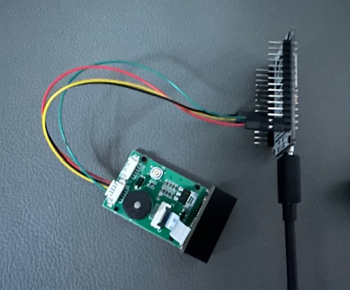
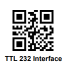

# Home Assistant (and Mealie) Barcode Scanner and Product Lookup

[](https://github.com/MattFryer/HA-Mealie-Barcode-Scanner/blob/master/LICENSE)
[](https://app.codacy.com/gh/MattFryer/HA-Mealie-Barcode-Scanner/dashboard?utm_source=gh&utm_medium=referral&utm_content=&utm_campaign=Badge_grade)


[](http://isitmaintained.com/project/MattFryer/HA-Mealie-Barcode-Scanner "Average time to resolve an issue")


Being big users of both Home Assistant and Mealie, for a while I've looked for a solution to add items quickly to our Mealie shopping list by scanning the product barcode. I’ve seen lots of questions about the same idea on the HA community and Reddit, but haven’t seen any great solutions. So I set about making my own. The code for which, and my notes as I develop the hardware and software, can be found in this repository.

> [!IMPORTANT]
> This project is a work in progress and is currently no more than a Proof Of Concept (PoC). It is therefore subject to change and the code and examples in this repository may not work. The below is not an exhaustive walkthrough and so a reasonable understanding of Home Assistant and ESPHome will be needed to successfully follow and implement.

> [!WARNING]
> No warranties or guarantees are made regarding the contents of this repository. Anyone using the code or instructions does so at their own risk!

## Contributing
If you'd like to help or contribute to this project, feel free to get in touch with ideas or suggestions using the [Discussions](MattFryer/HA-Mealie-Barcode-Scanner/discussions) section. Or contribute to the development by sending [pull requests](MattFryer/HA-Mealie-Barcode-Scanner/pulls).

If you just want to show your appreciation, you can sponsor the project or send a one off donation using the links below:

[](https://buymeacoffee.com/mattfryer)
[](https://github.com/sponsors/MattFryer)

## Table of Contents
- [The Idea](#the-idea)
- [The Solution](#the-solution)
  - [The Hardware](#the-hardware)
    - [Parts](#parts)
    - [Wiring](#wiring)
    - [GM67 Configuration](#gm67-configuration)
    - [ESPHome YAML](#esphome-yaml)
    - [Home Assistant Device Config](#home-assistant-device-config)
  - [Product Lookup](#product-lookup)
    - [Install the Pyscript Integration in HA](#install-the-pyscript-integration-in-ha)
    - [Add the python script under Pyscripts](#add-the-python-script-under-pyscripts)
  - [Home Assistant Automation](#home-assistant-automation)
    - [Scanned Barcode Event](#scanned-barcode-event)
    - [Calling the Python script to lookup the barcode](#calling-the-python-script-to-lookup-the-barcode)
    - [Passing the product back to the ESPHome device](#passing-the-product-back-to-the-esphome-device)
    - [Adding the product to a HA To-Do List (including a Mealie shopping list)](#adding-the-product-to-a-ha-to-do-list-including-a-mealie-shopping-list)
- [Planned Improvements / To Investigate](#planned-improvements--to-investigate)


## The Idea
The main idea is to have a way to scan a product barcode whilst preparing a meal in the kitchen and have that item added to the weekly supermarket shopping list. To ensure it is used by the whole family, it needs to be fast and simple to scan a barcode whilst preparing a meal. Ideally, it will use a device mounted in the kitchen so that it doesn't require a mobile phone to work. 

Once a barcode is scanned, it will need to be converted to a product name and then added to the shopping list. This could be any To-Do list in Home Assistant, including one created and synched by the Mealie integration. It will need a method to highlight when a product name can't be found and to prompt the user to add the product name manually. This should be stored for future lookup.

### Supported Barcodes
The scanner needs to support all barcode standards commonly in use. The 4 most common standards are:

| Standard | Barcode Length | Use                                                                             |
|----------|----------------|---------------------------------------------------------------------------------|
| EAN-13   | 13-digit       | Most commonly used across Europe.                                               |
| EAN-8    | 8-digit        | Used across Europe. Used on smaller products unable to fit a larger barcode.    |
| UPC-A    | 12-digit       | Mostly used in North America                                                    |
| UPC-E    | 8-digit        | Used in North America. Used on smaller products unable to fit a larger barcode. |

The GM67 barcode scanning head supports all of the above standards and many more. The code must be able to handle these barcode lengths also.

### Generic Product QR Codes
As well as scanning genuine numeric product barcodes, the GM67 supports scanning QR codes. We can use this capability to have special QR codes which allow us to add generic products to our shopping list. 

You can create special QR codes using free online QR code generators. As long as the QR code contains text beginning with `GENERIC:` the text after will be passed to Home Assistant to be added to the shopping list. 

An example QR code would be the below which contains the text `GENERIC:Milk`. 


## The Solution
The PoC solution is made up of 3 main parts: 
1. A hardware solution to scan the product barcode and pass it to Home Assistant. This is powered using ESPHome for speed of implementing and ease of integration into Home Assistant.
2. A Python script running in the Pyscripts integration in Home Assistant which looks up a barcode on the OpenFoodFacts.org and/or UPCDatabase.org API and returns the product name.
3. A Home Assistant Automation to link the above together, triggering when a barcode is scanned, passing it to the Python script to get the name and then adding it to the desired shopping list.

### The Hardware

For simplicity of creation and integration with Home Assistant, prototype hardware has been created using off the shelf development boards and [ESPHome](https://esphome.io/). The final hardware solution may include custom hardware and will likely also use ESPHome. If it is ever productionised, ESPHome can also be used with ability to register a product for automatic updates, etc. 

#### Parts

The minimum required hardware would be:
- An ESP8266 or ESP32 development board which can be brought widely on ebay or Aliexpress for under £5 (GBP). (e.g. [https://www.ebay.co.uk/itm/166478265403](https://www.ebay.co.uk/itm/166478265403))
- A suitable barcode scanner board such as GM67 which can be brought widely on ebay and Aliexpress for around £20 (GBP). (e.g. [https://www.ebay.co.uk/itm/365225165259](https://www.ebay.co.uk/itm/365225165259))



Optionally, you could also add a screen or LEDs to indicate if a scanned product was successfully identified. You could also add buttons to switch the scanner on and off, or even to change which list you would like the product adding to. I might add these features to my eventual solution. 

#### Wiring
We need to wire the GM67 to the ESP board. Which pins on the ESP board you choose to use is up to you but your ESPhome YAML needs to match the pins. The below table shows the wiring colours and pins for the example ESPHome YAML files.

> [!CAUTION]
> The wiring colours of the cable provided with the GM67 are not standard. Care should be taken to ensure the correct wiring in order to not damage either the GM67 or the ESP board. Do not rely on the wiring colours as the cable provided may not be the same as the one I received.

| GM67 Board UART/TTL Pin | ESP Board Pin | Supplied Wire Colour |
| ----------------------- | ------------- | -------------------- |
| GND                     | GND           | Green                |
| RX                      | GPIO13        | Yellow               |
| TX                      | GPIO15        | Black                |
| 5V                      | 5V            | Red                  |

The cable provided for UART/TTL with the GM67 had bare wires to which I added Dupont connectors to make it simple to connect to the ESP board. You can connect however you wish (e.g. soldering). 

#### GM67 Configuration
Out of the box, the GM67 I received was configured to only talk on the USB interface. Unless this is changed, it won't interface and send barcodes to the ESP board. To change settings on the GM67 there is an extensive document containing special QR codes that you can scan to apply settings. The documentation for all of the GM range of barcode scanners can be found [HERE](https://www.dropbox.com/scl/fo/87hz5h82k25j3p9k5u603/AJfkL6iYDATRGkLYJjuhUJE?rlkey=2fyvdir15kb1kj2ada1zkadqt&e=1&dl=0).

Assuming you have the GM67 like I do, you can scan the following QR code with the scanner to enable UART/TTL mode:


<!-- QR code contains "^#SC^3030010" -->

Other configuration options for the GM67 are available from within Home Assistant once the ESPHome device has been configured.

So far, the GM67 has been very fast, accurate and reliable. 

> [!TIP]
> The GM67 seems to be good at reading codes from screens also and so you can open this page on your phone to be able to scan the above QR code easily. 

#### ESPHome YAML
An example ESPHome YAML configuration file can be found in this repository under [/esphome/example-esphome-gm67.yaml](esphome/example-esphome-gm67.yaml). Some of the sensors created in the example are disabled in HA by default but can be enabled to help with debugging. 

A number of configuration options for the GM67 are also contained within the example YAML file. These settings can be used to tailor the GM67's behaviour and can be set from within Home Assistant. The available config options are as follows:
- Buzzer Volume: Sets the volume of the beep emitted when a barcode is scanned. Can also be used to turn off the buzzer.
- Trigger Mode: Allows you to set the trigger mode which starts the GM67 scanning. The available options are: 
  - "Button Holding" - which requires you to hold the button on the device in order to scan a barcode.
  - "Button Trigger" - starts the device scanning after a short press of the button. 
  - "Continuous Scanning" - which does exactly what it says and sets the GM67 to continuously attempt to scan a barcode.
  - "Automatic Induction" - which turns on the scanning only when the light level in front of the scanner changes (e.g. when a product is placed in front) and turns off again after a short duration or if a barcode is scanned. This mode prevents the continuous red and white scanning lights from being on constantly.
  - "Host" - which sets the GM67 to only operate when instructed to do so from the host device via UART/TTL commands.
- Scanning Light: Allows you to set the white scanning light to always off, always on, or on only when the device is trying to scan.
- Collimation: These are the red scanning lines emitted by the scanner which help to line up a barcode to be scanned. Like the scanning light, they can be set to always on, always off, or on only when the device is trying to scan.
- Collimation Flashing: Allows you to turn on or off the flashing of the Collimation lines. 
- Same Code Delay: Allows you to set the delay between the device allowing you to scan the same barcode. This can help to prevent accidental duplicate scans. It can be set from between half a second to 7 seconds or can disallow duplicate scans which prevents the same barcode being scanned twice in a row.
- Scanning Enabled: Allows you to disable or enable the scanner as needed. If disabled, barcodes cannot be scanned. 

> [!TIP]
> The "Scanning Enabled" setting can be useful as a child lock to prevent children scanning barcodes. Having it toggled when a button is held on the device could be one solution. It can be used to disable the scanner at night so it doesn't shine the scanning or collimation lights. You could automate this on a shedule using a Home Assistant automation.

> [!TIP]
> If you have any issues creating the hardware, you can try adding the following to your ESPHome YAML configuration:
> ```yaml
> logger:
>   level: VERBOSE
> ```
> This will enable more detailed debug logging which should include all UART messages coming from the barcode scanner. This can help to prove the ESP and scanner are communicating correctly.

> [!IMPORTANT] 
It is worth rechecking the example periodically as it is being regularly updated as the proof of concept device is developed. Additional examples may also be added.

#### Home Assistant Device Config
The new device should show up in HA called "barcode-scanner" unless you changed it in the ESPHome YAML. Add it to Home Assistant as you would any other ESPHome device (it should be automatically found by HA). 

> [!IMPORTANT]
> If you do not perform the next steps, the ESPHome device will not be able to trigger events on the Home Assistant event bus which are needed to trigger the Home Assistant Automation later.

Follow the below steps to allow the device to trigger events on the HA event bus:
1. Open the ESPHome integration page on your Home Assistant instance:
    
    [](https://my.home-assistant.io/redirect/integration/?domain=esphome)
2. Find your barcode scanning device in the device list.
3. Click the “CONFIGURE” button next to it.
4. Check the “Allow the device to perform Home Assistant actions” box.
5. Then click “submit”.

You can now check the device is working and connected to Home Assistant correctly:
1. Navigate to Developer Tools -> Events
2. Under "Listen to events" enter "esphome.barcode_scan"
3. Click "Start listening"
4. Scan a barcode with the device and you should see an event appear containing a line beginning "barcode:" followed by the barcode you scanned. Something like the below:
    ```yaml
    event_type: esphome.barcode_scan
    data:
      device_id: ee685dc4d9ccb1de6e97a84beb7be650
      barcode: 4088600550862
    origin: LOCAL
    time_fired: "2025-01-20T12:54:21.634458+00:00"
    context:
      id: 01JJ1WEGP22MANX2VFREP5B2JV
      parent_id: null
      user_id: null
    ```

> [!IMPORTANT]
> Ensure you have the above working and can see the "barcode_scan" events in Home Assistant before moving on.

### Product Lookup
A custom python script is used to look up a passed product barcode on the [openfoodfacts.org](https://openfoodfacts.org/) website and return the name of the product. Home Assistant can run custom python scripts directly but additional python libraries can't be imported which limits what can be done with them.

Instead, we can use the [Pyscript](https://github.com/custom-components/Pyscript) integration to run our python script. 

#### Install the Pyscript Integration in HA
If you aren't already using Pyscripts for some other purpose then you need to install it. Full instructions for how to install the Pyscript integration can be found on the repository [https://github.com/custom-components/Pyscript](https://github.com/custom-components/Pyscript). 

Pyscript can be easily installed via the Home Assistant Community Store (HACS). Assuming you have HACS installed within your HA instance already, simply search for "Pyscript" within HACS (or click on the below button), and then install it. 

[](https://my.home-assistant.io/redirect/hacs_repository/?repository=pyscript&owner=custom-components)

Once installed, you need to add the integration under the integrations section of Home Assistant. You can do this manually or you can click the below button:

[](https://my.home-assistant.io/redirect/config_flow_start/?domain=pyscript).

> [!IMPORTANT]
> Make sure to check the option for "Allow All Imports?" when adding the Pyscript integration. If you do not, our python script will not be able to load the needed python modules. Don't worry if you missed it or already have Pyscripts installed, you can check and set this option by going to the Pyscript integration page and clicking on "CONFIGURE".

#### Add the python script under Pyscripts
Pyscript can have a bit of a learning curve to set up and the documentation isn't be best for beginners. Don't worry though, if this is the first time you are using Pyscript in your HA instance, you can simply copy the "pyscript" folder and all of its contents and subfolders from this repository to your Home Assistant config folder. 

If you already had Pyscript installed and running other python scripts, you should hopefully already understand the basics of how Pyscript is configured. You will need to copy the "pyscript/apps/barcode_lookup" folder and its contents from this repository under your existing "pyscript/apps" folder (or create one) in your Home Assistant config folder. You will also need to amend your "pyscript/config.yaml" file to include the definition and settings for this new Pyscript app. You can copy them from the ["pyscript/config.yaml"](pyscript/config.yaml) file in this repository.

> [!TIP]
> Pyscript should pick up the new script and config automatically but to be certain it is best to restart Home Assistant to make sure everything is reloaded.

<!-- Options in the config for config csv location and turning off, turning on and off the diff APIs and setting API keys in secrets -->

The Pyscript app configuration contains the base path to use for the OpenFoodFacts.org API. This is so that it is easy to amend in the future if needed without having to modify the python script (i.e. if they move from v2 to v3 of their API).

If the Pyscript app has been installed and configured correctly, you should be able to test calling the created service from within Home Assistant:
1. Navigate to Developer Tools -> Actions
2. Find and select the "Pyscript Python scripting: Barcode Lookup" action.
3. Click the "FILL EXAMPLE DATA" link from under the "All available parameters" section which should configure the action with the barcode "5000147030156".
4. Click on "PERFORM ACTION"
5. If all is configured and working properly you should see a returned response which looks like this:
    ```yaml
    result: success
    barcode: 5000147030156
    brand: Robinsons
    title: Summer Fruits Squash
    type: food
    quantity: ""
    ```

As you can see, the returned data contains a number of fields from the OpenFoodFacts API witch you can use as conditions in automations. For example, you could use the "result" to only add the product to the shopping list if a successful match is found. Or you could add the product to a different shopping list if the "type" isn't food.

> [!IMPORTANT]
> Ensure you have the above working and you can call the service and get a success response before moving on.

> [!TIP]
> If you have issues, you can enable verbose logging for Pyscript by adding the below to your Home Assistant configuration.yaml:
>   ```yaml
>   logger:
>     logs:    
>       custom_components.pyscript: info
>   ```
> You should then be able to see detailed logging including any errors in the Home Assistant logs.

### Home Assistant Automation
Home Assistant automations can be used to automate the receiving of barcodes from the scanner, passing them to the python script to be looked up, and adding of the returned product to your chosen To-Do List in Home Assistant. Optionally, the To-Do List can be a shopping list synched between Mealie and Home Assistant using the HA Mealie integration. 

If you don't already have the Mealie integration installed, it is now a core HA integration and can be added straight to Home Assistant. For ease, you can click the below button to add it to your HA instance:

[](https://my.home-assistant.io/redirect/config_flow_start/?domain=mealie)

An example Home Assistant Automation YAML file can be found in this repository under [/ha_automation/example-automation.yaml](ha_automation/example-automation.yaml). You can copy this to your Home Assistant as a new automation and amend as needed.

Below are some more details of the key building blocks in the example automation above. As with any HA automation, the possibilities for what you could do are almost endless. You can use and modify the below building blocks to meet your specific needs.

#### Scanned Barcode Event
When a barcode is scanned by the device, it triggers an event on the HA event bus. These events are the best and most reliable way to trigger an automation. An event should look something like this:
```yaml
event_type: esphome.barcode_scan
  data:
    device_id: ee685dc4d9ccb1de6e97a84beb7be650
    barcode: 4088600550862
  origin: LOCAL
  time_fired: "2025-01-20T12:54:21.634458+00:00"
  context:
    id: 01JJ1WEGP22MANX2VFREP5B2JV
    parent_id: null
    user_id: null
```
The event data contains 2 values which can be used in the automation:
- `device_id` gives the ID of the ESPHome device that sent the scan event. This can be useful if you have more than one barcode scanning device and want to return the scanned value to the correct device or even behave differently depending upon where the event originated from.
- `barcode` gives the value if the barcode that was scanned. For most product barcodes this is a 13 digit number.

Add a "Manual event" trigger to your automation and set the "Event type" to `esphome.barcode_scan`. Optionally, to only trigger if the event came a specific device, add `device_id: XXXXXXXXXXXXXXXXXXXXXXXXXXXXXXXX` in the "Event data" field changing the XXX's to your device ID .
                                          
The data passed in the event can be referenced in templates in any other part of your automation using `{{ trigger.event.data.barcode }}`

#### Special QR Scan Event
The event fired when a generic product QR code is scanned is `esphome.generic_barcode_scan`. The event payload look similar but slightly different as below:
```yaml
event_type: esphome.generic_barcode_scan
data:
  device_id: ee685dc4d9ccb1de6e97a84beb7be650
  product: Milk
origin: LOCAL
time_fired: "2025-01-28T19:48:23.489490+00:00"
context:
  id: 01JJQ7ACA13SSR733QG3KR8K46
  parent_id: null
  user_id: null
```
You can see that the event data contains the `device_id` which can be used as described above. Instead of a barcode we have a `product` value containing the text from the QR code (the `GENERIC:` part has).

The data passed in the event can be referenced in templates in any other part of your automation using `{{ trigger.event.data.product }}`.

#### Calling the Python script to lookup the barcode
Add the "Pyscript Python scripting 'Barcode Lookup'" action to your workflow. 

We'll need to use HA templates to pass the barcode and so unfortunately as soon as we add a template to the barcode field it will tell us that it isn't possible to configure it using the visual editor. Instead, we have to use YAML and it should look something like this once configured:

```yaml
action: pyscript.barcode_lookup
metadata: {}
data:
  barcode: "{{ trigger.event.data.barcode }}"
response_variable: product
enabled: true
```

Note the `trigger.event.data.barcode` which gets the barcode passed in the event trigger above. 

Also note the `response_variable: product` which provides a variable for the python script to pass data back in. We'll use this variable in any following steps where we want to use information about the product returned from the barcode lookup. The variable will contain a data structure of multiple values. If a matching product was found, it should look something like this:

```yaml
result: success
barcode: 5000147030156
brand: Robinsons
title: Summer Fruits Squash
type: food
quantity: ""
```

If no match was found, the response data structure will be much simpler:

```yaml
result: unknown
barcode: 5000147030156
```

These returned data structures can be used in HA templates. For example, we can use `true` to check whether or not a match was found. Assuming a match was found, we could use `{{ product.title }}` to get the name of the product. 

> [!TIP]
> You can use any other returned value in a similar way, changing "title" in `{{ product.title }}` to the name of the field in the returned data structure. (e.g. `{{ product.brand }}`)

#### Passing the product back to the ESPHome device
There are several ways to pass data from Home Assistant to an ESPHome device. The example ESPHome YAML configuration includes one such method, an action which the device registers with HA. 

This action is called "ESPHome 'esphome.barcode_scanner_product_identified'" and can be used like any other action in an automation. It accepts a product in the data field. As above, using templates in the "data" field causes us to have to use YAML. 

The below example YAML shows how to pass the returned product name if one is found. If one isn't then "Unknown" is passed instead.

```yaml
action: esphome.barcode_scanner_product_identified
metadata: {}
data:
  product: >-
    
      {{product.title}} 
    
      Unknown
    
``` 

This text could then be used in ESPHome to display on a screen.

#### Adding the product to a HA To-Do List (including a Mealie shopping list)
You can use the Home Assistant action "To-do list 'Add item'" to add an item to any To-Do list. You simply provide an entity ID for the To-Do list you wish to add it to and an item name. Yet again, using templates forces us to use YAML which should look something like this:

```yaml
action: todo.add_item
metadata: {}
data:
  item: "{{ product.title }}"
target:
  entity_id: todo.mealie_supermarket
```
> [!TIP]
> One benefit of Mealie Shopping lists synched with Home assistant is in their handling of duplicate entries. In normal Home Assistant To-Do lists, if the same product is added to the list twice or more, it will appear as multiple entries in the list (i.e. "Product 123" would appear in the list twice). In a Mealie synched shopping list, Mealie merges duplicate entries, adding a number to the front of them do indicate how many of them are required (i.e. adding "Product 123" three times would be displayed as a single entry of "3 Product 123").

## Planned Improvements / To Investigate
This is just a brain dump of ideas for improving the proof of concept or to investigate further. If you have other ideas or suggestions, please suggest them in the [Discussions section](/MattFryer/HA-Mealie-Barcode-Scanner/discussions) and I'll add them.

### Documentation
- [ ] Add how to register of a UPCDB API key and how to store it in your HA secrets so it will be used by the python script.
- [ ] Update the readme about caching of products and being able to disable it. Also the clear cache and add to cache actions
- [ ] Update the readme for disabling OpenFoodFacts and/or UPCDatabase.
- [x] Update readme with info on QR codes to add an item to the shopping list (e.g. "GENERIC:Milk")
- [ ] Consider splitting the readme into separate Wiki pages instead.
- [ ] Add info on supported barcode formats and numeric lengths (EAN-13, EAN-8, UPC-A and UPC-E).

### Pyscript and automation
- [x] Switch to using openfoodfacts.org for primary lookup instead as seems better populated.
- [x] If the product isn't found on openfoodfacts.org then try upcdatabase.org instead. Possible other sources of product lookup also.
- [x] Implement a local cache of barcodes and their product names to prevent hitting the APIs unnecessarily and also to allow adding custom matches to override or for unknown products.
- [ ] If a product isn't found anywhere, HA could send a notification asking for you to input the product name. It can then be added to the cache for future lookup. Could even send only those at home or to whoever is in the kitchen using presence detection. Or even ask using a voice assistant?
- [ ] Consider implementing the automation and python as a HA integration for easier set up. Might be less flexible though.
- [ ] Investigate if a scanned product can be found on Amazon and added to your shopping basket ready for purchase.
- [x] Option to have special QR codes which when scanned add some text in the QR code to the list rather than doing a barcode lookup (e.g. Add "Milk" to the shopping list). Possible to trigger a different HA event if the scanned code starts with a specific string.
- [x] The APIs some times return a success but have no name for the product. The code needs to handle these as unknown.

### Hardware
- [x] Investigate sending serial commands to the GM67 to allow for options in the HA device to configure the scanning mode, to turn off the scanner, etc. 
- [ ] A screen on the scanner for feedback of if the scanned code was found and buttons to change which shopping list you want the product added to.
- [ ] 3D printable case to house the parts under a kitchen cupboard with the barcode scanner facing down. Straight down or angled?
- [ ] Better detecting of a product in front of the scanner using a time of flight sensor if the inbuilt sensing proves to be inaccurate.
- [ ] Consider a custom PCB to make a more productionised product. Or an alternative hand-held version.
- [x] Add support for 12 digit UPC-A barcodes also